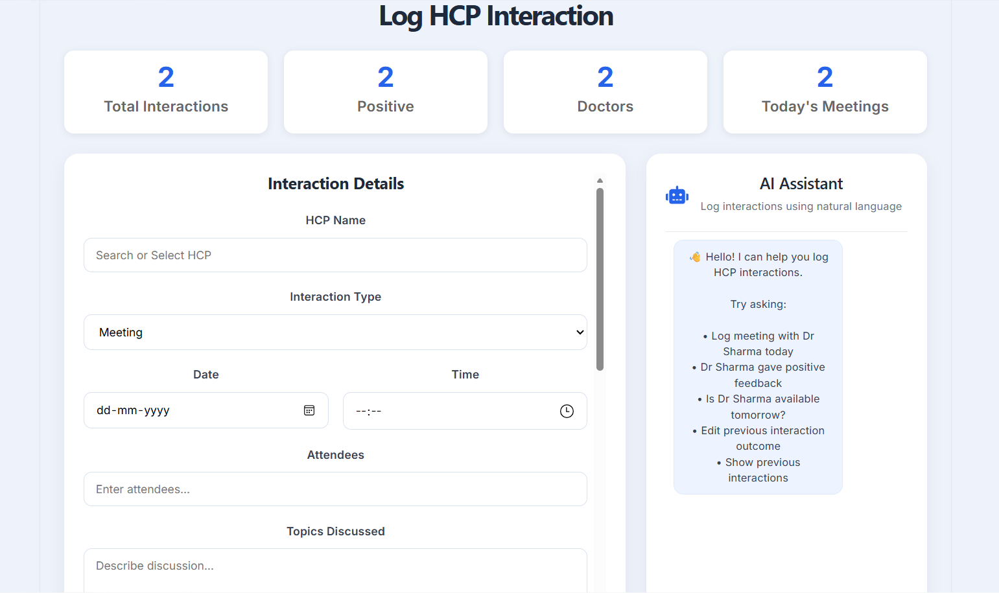
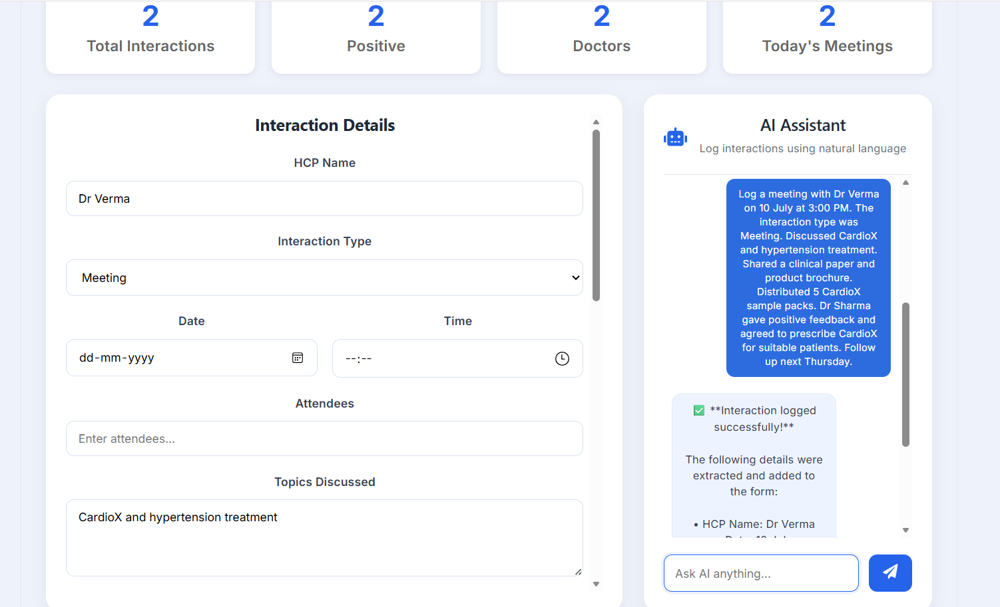
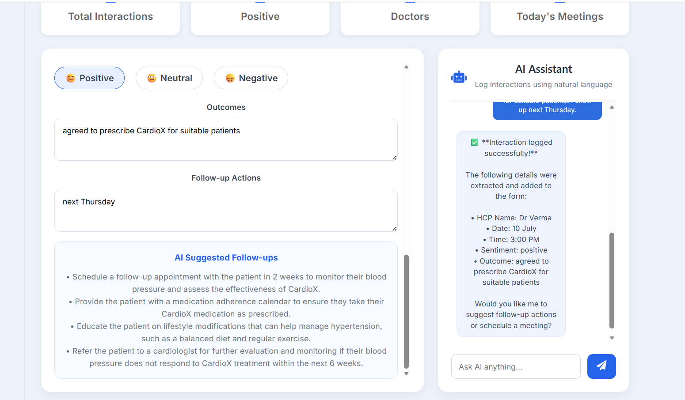
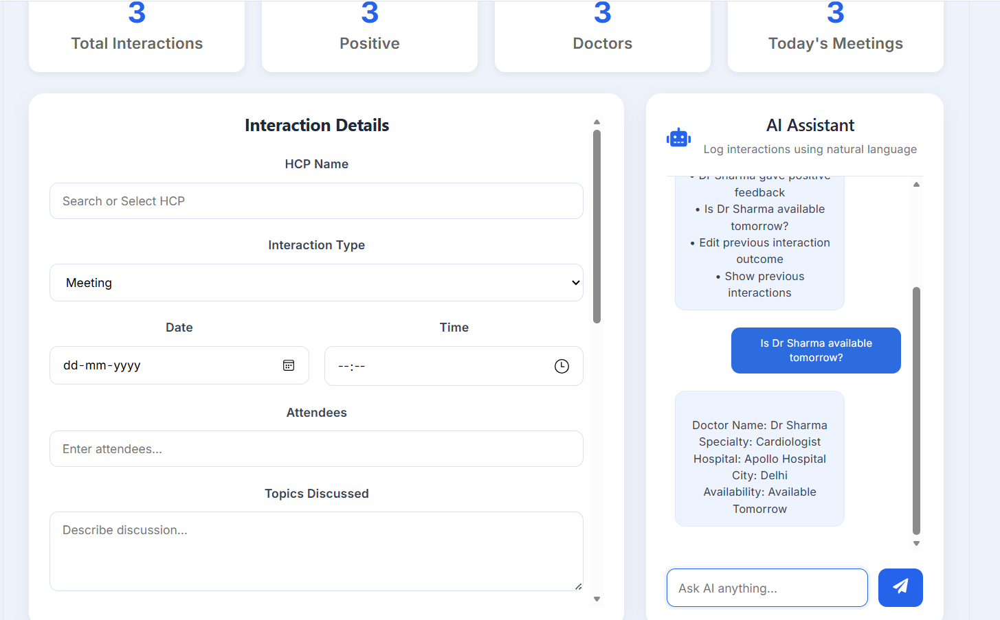
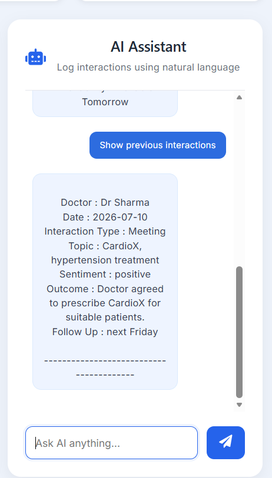
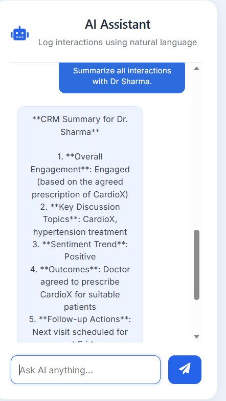

# AI-First CRM

An AI-powered Customer Relationship Management (CRM) application for pharmaceutical sales representatives. The system enables users to log doctor interactions using natural language, automatically populate CRM forms with AI, generate intelligent follow-up recommendations, and manage interaction history efficiently.


   

---

## Features

- AI Chat Assistant for natural language interaction logging
- Automatic interaction form autofill using AI
- Edit previously logged interactions
- View interaction history
- Summarize previous interactions
- Doctor availability checking
- AI-generated follow-up recommendations
- Dashboard with interaction analytics
- Responsive and user-friendly interface

---

## 📸 Project Screenshots

### Dashboard



---

### Automatic Form Autofill



---

### AI Suggested Follow-ups



---

### Doctor Availability



---
## Interaction History and Summary

<table>
<tr>
<td align="center">
<b>Interaction History</b><br><br>

</td>

<td align="center">
<b>Interaction Summary</b><br><br>

</td>
</tr>
</table>

## LangGraph Tools Implemented

### 1. Log Interaction
Extracts interaction details from natural language and populates the CRM form automatically.

### 2. Edit Interaction
Updates existing interaction details such as sentiment or outcome.

### 3. View Interaction History
Displays previous interactions for a selected healthcare professional.

### 4. Summarize Interactions
Provides an AI-generated summary of previous interactions.

### 5. Check HCP Availability
Checks doctor availability from the HCP master database.

---

## Tech Stack

### Frontend

- React.js
- CSS
- Axios
- React Icons

### Backend

- FastAPI
- SQLAlchemy
- SQLite
- Pydantic

### AI

- LangGraph
- LangChain
- Groq (Llama 3.1)
- Tool Calling

---

## Project Structure

```
AI-First-CRM
│
├── backend
│   ├── app
│   │   ├── main.py
│   │   ├── crud.py
│   │   ├── database.py
│   │   ├── models.py
│   │   ├── schemas.py
│   │   ├── tools.py
│   │   └── langgraph_agent.py
│   │
│   └── requirements.txt
│
├── frontend
│   ├── src
│   │   ├── components
│   │   ├── services
│   │   ├── App.jsx
│   │   └── main.jsx
│   │
│   └── package.json
│
└── README.md
```

---

## Installation

### Clone Repository

```bash
git clone https://github.com/your-username/AI-First-CRM.git

cd AI-First-CRM
```

---

### Backend Setup

```bash
cd backend

python -m venv venv

venv\Scripts\activate

pip install -r requirements.txt

uvicorn app.main:app --reload
```

Backend runs on

```
http://127.0.0.1:8000
```

---

### Frontend Setup

```bash
cd frontend

npm install

npm run dev
```

Frontend runs on

```
http://localhost:5173
```

---

## API Endpoints

| Method | Endpoint | Description |
|----------|----------|------------|
| POST | /chat | AI Chat Assistant |
| POST | /interactions | Save Interaction |
| GET | /interactions | Get Interaction History |
| GET | /hcp | Fetch Doctors |
| POST | /suggest-followup | Generate AI Follow-ups |
| GET | /dashboard | Dashboard Statistics |

---

## AI Workflow

1. User enters interaction in natural language.
2. AI extracts structured information.
3. CRM form is automatically populated.
4. AI generates follow-up recommendations.
5. Interaction is stored in the database.
6. Dashboard updates automatically.

---

## Future Improvements

- Voice note transcription
- Authentication
- Calendar integration
- Email reminders
- Multi-user support

---

**Anshika Agrawal**

🎓 B.Tech – Computer Science Engineering

📧 Email: anshikaagrawal2410@gmail.com

🔗 GitHub: https://github.com/anshika2410-hub

---

<div align="center">

### ⭐ If you like this project, don't forget to Star the repository ⭐

Made with ❤️ by **Anshika Agrawal**
